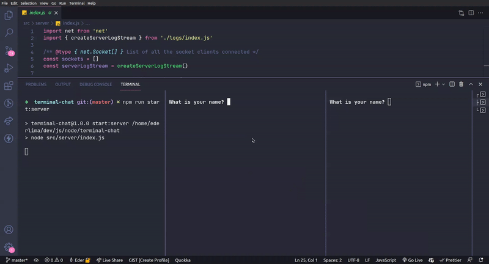

# Terminal chat

A realtime chat made using NodeJS for using inside the terminal.

## Demo



## How to run?

1. Install the dependencies

```sh
$ npm i
```

2. Start the server

```sh
$ npm run start:server
```

3. Start a client

```sh
$ npm run start:client
```

## Author

|  |
| ----------------------------------------------------- |
| [Eder Lima](https://github.com/Nxrth-x)               |
